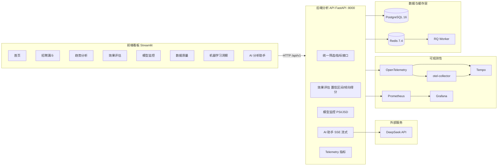

# AIHR 技术栈文档

> 本文档梳理 AIHR（AI 招聘推荐效果评估与监控系统）使用到的完整技术栈，覆盖语言、框架、数据、可视化、可观测性与工程化，并说明各技术在实际项目中的用途。

## 1. 项目简介

**AIHR** 是一个面向招聘业务的数据分析产品，用于评估 **AI 推荐 vs 人工推荐** 在招聘漏斗中的真实表现差异，并定位效果变化的原因。

当前系统以 **FastAPI + PostgreSQL + SQLAlchemy + Streamlit** 为核心构建，覆盖漏斗分析、趋势分析、效果评估、模型监控、数据质量、机器学习洞察与 AI 分析助手等能力。

- 开发语言：**Python ≥ 3.10**
- 包管理：`pyproject.toml`（setuptools 构建，`src/` 布局）
- 容器化：Docker Compose（多阶段构建）

## 2. 技术栈总览

| 模块 | 技术选型 | 主要用途 |
|---|---|---|
| 后端 API | **FastAPI**、Pydantic v2、Uvicorn | 统一筛选、结构化响应、指标/模型/监控接口，SSE 流式输出 |
| 数据访问 | **SQLAlchemy 2.0**、Alembic | ORM、会话管理、数据库迁移 |
| 数据库 | **PostgreSQL 16**（生产）、SQLite（本地）、MySQL（兼容配置） | 指标明细存储，驱动 psycopg / PyMySQL |
| 前端看板 | **Streamlit**、Plotly、requests | 8 个分析页面、图表与筛选交互 |
| 数据处理 | **pandas**、NumPy、PyArrow | 指标计算、数据处理、数据源加载 |
| 统计与机器学习 | **scikit-learn**、SciPy、statsmodels | 显著性检验、置信区间、倾向得分、逻辑回归、孤立森林、PSI/JSD 漂移 |
| 缓存与队列 | **Redis 7.4**、RQ | API/分析上下文缓存、异步分析队列 |
| AI 分析助手 | **DeepSeek API**（deepseek-chat） | SSE 流式回答、异常归因与解释，含信任边界（assistant_trust） |
| 可观测性 | **Prometheus**、OpenTelemetry、Tempo、Grafana | 指标、链路追踪、日志告警可视化 |
| BI 工具 | Apache Superset（可选）、Grafana | 独立 BI 看板（`docker/bi/`） |
| 工程验证 | **pytest**、ruff、httpx | 行为测试、代码质量检查 |
| 部署编排 | Docker、Docker Compose、RQ Worker | 多环境部署、后台任务 |

## 3. 分层详细说明

### 3.1 后端 API（FastAPI）

- **FastAPI ≥0.115**：异步 Web 框架，自动生成 OpenAPI 文档。
- **Pydantic v2**：请求/响应模型校验（`src/aihr/schemas.py`）。
- **Uvicorn**：ASGI 服务器，`uvicorn aihr.api.main:app --reload`。
- **StreamingResponse**：AI 助手 SSE 流式响应（`docs/adr/0005-stream-assistant-responses-over-sse.md`）。
- **CORSMiddleware**：跨域配置（前端 8501 ↔ API 8000）。
- 统一前缀 `/api/v1`，路由在 `src/aihr/api/routers/`。
- 生命周期管理：建表、种子数据、分析上下文预预热（prewarm）、Telemetry 初始化。

### 3.2 数据访问与数据库

- **SQLAlchemy 2.0**：声明式 ORM（`Base`）、Session 依赖注入、`text()` 原生 SQL。
- **Alembic**：数据库迁移（`migrations/versions/`），容器启动时 `alembic upgrade head`。
- **数据库选型**：
  - 生产（Docker）：**PostgreSQL 16**，驱动 `psycopg[binary]`。
  - 本地开发：**SQLite**（`config.ini` 默认 `sqlite+pysqlite:///./aihr.db`）。
  - 兼容配置：**MySQL**（`config.ini` 含 mysql 段，驱动 PyMySQL）。
- **多环境配置**：`config/config.ini` + `config.local.ini` / `config.Test.ini` / `config.Online.ini`（configparser）。

### 3.3 数据处理与分析

- **pandas / NumPy / PyArrow**：数据源导入（`scripts/import_kaggle_jobs.py`）、指标加工、批量计算。
- **数据源**：Kaggle LinkedIn 招聘数据集 + 合成种子数据（`src/aihr/seed.py`，可配置候选人数/岗位数/推荐量）。
- **SQL 数据分层**：`sql/staging` → `sql/marts` → `sql/quality_checks`。

### 3.4 统计与机器学习

- **SciPy / statsmodels**：
  - 面试率等指标的**比例差与 95% 置信区间**；
  - **倾向得分调整**（降低 AI/人工推荐人群结构差异导致的比较偏差）；
  - **SMD 平衡诊断**（调整前后标准化均数差）。
- **scikit-learn**：
  - **逻辑回归**预测推荐进入面试的概率；
  - **孤立森林**异常检测（特征组合异常且预测与结果不一致的样本）；
  - 概率分层、分群表现对比。
- **漂移监控**：数值特征 **PSI**、类别特征 **JSD**、推荐分数漂移、基准期对比与告警分级。
- 服务实现在 `src/aihr/services/analytics_*.py`（effectiveness / ml / monitoring / quality 等）。

### 3.5 前端看板（Streamlit）

- **Streamlit ≥1.40**：首页 + 8 个分析页面（`app/首页.py`、`app/pages/*.py`）。
- **Plotly**：漏斗图、趋势图、漂移监控图、概率分层看板等 ≥5 种图表。
- **requests**：封装 API 客户端（`app/api_client.py`），统一筛选参数（来源/岗位/地区/模型版本/顾问团队/日期）。
- 状态持久化：`.aihr_filter_state.json` 保存筛选状态。

### 3.6 缓存与异步队列

- **Redis 7.4**：`services/cache.py` 的 JSON 缓存、AI 助手结果缓存（TTL 300s）。
- **RQ**：异步分析队列（`rq worker --url redis://cache:6379/0 aihr`），用于分析上下文预预热等耗时任务。

### 3.7 AI 分析助手（DeepSeek）

- **DeepSeek API**：`deepseek-chat`，通过 `AIHR_ASSISTANT_BASE_URL / MODEL / API_KEY` 配置。
- **SSE 流式响应**：逐步返回分析结论，非阻塞前端。
- **信任边界**：`assistant_trust.py` 限制 LLM 只做归纳解释、不直接计算指标，避免生成错误数字。
- 相关 ADR：`0003-server-side-deepseek-assistant.md`、`0004-assistant-trust-envelope.md`、`0005-...sse.md`、`0006-...prewarm...md`。

### 3.8 可观测性

- **Prometheus + prometheus-client**：API 指标（`services/prometheus_metrics.py`），`/metrics` 暴露，`alerts.yml` 告警规则。
- **OpenTelemetry**：OTLP HTTP exporter，instrumentation 覆盖 FastAPI / requests，上报到 otel-collector。
- **Tempo**：链路追踪后端；**Grafana**：指标与看板展示（`ops/observability/`）。
- 相关文件：`ops/observability/{otel-collector,prometheus,tempo,alerts}.yml`、`grafana/`。

### 3.9 工程验证与质量

- **pytest**：行为导向测试（`tests/`，覆盖 API、服务层、导入、迁移、指标、助手等）。
- **ruff**：代码检查与格式化（`ruff check .`，选择 E/F/I/UP/B 规则，line-length 100）。
- **httpx**：测试用异步 HTTP 客户端。
- **Codex 技能流**：`/tdd`、`/diagnosing-bugs`、`/code-review` 等（见 `AGENTS.md`）。

## 4. Python 依赖清单（pyproject.toml）

**核心依赖**

```toml
fastapi>=0.115,<1.0        # Web 框架
pydantic>=2.0,<3.0         # 数据校验
uvicorn[standard]>=0.30    # ASGI 服务器
sqlalchemy>=2.0,<3.0       # ORM
psycopg[binary]>=3.2       # PostgreSQL 驱动
pymysql>=1.1               # MySQL 驱动
pandas>=2.0,<4.0           # 数据处理
pyarrow>=15.0              # 列式内存/数据交换
numpy>=1.24                # 数值计算
scipy>=1.10                # 科学计算/统计检验
statsmodels>=0.14          # 统计模型/置信区间/倾向得分
scikit-learn>=1.3          # 机器学习
streamlit>=1.40            # 前端看板
plotly>=5.24               # 可视化
requests>=2.31             # HTTP 客户端
redis>=5.0                 # 缓存
alembic>=1.14              # 数据库迁移
prometheus-client>=0.21    # Prometheus 指标
rq>=2.1                    # 异步任务队列
opentelemetry-*            # 链路追踪（api/sdk/otlp/fastapi/requests instrumentation）
```

**开发依赖（[dev]）**

```toml
httpx>=0.27,<1.0   # 测试 HTTP 客户端
pytest>=8.0        # 测试框架
ruff>=0.8          # 代码质量
```

## 5. 容器化服务（compose.yaml）

| 服务 | 镜像/技术 | 端口 | 说明 |
|---|---|---|---|
| `postgres` | postgres:16-alpine | 5432 | 主数据库，密码用 Docker Secrets |
| `cache` | redis:7.4-alpine | — | 缓存 + RQ 队列，AOF 持久化 |
| `api` | aihr-api:local（FastAPI） | 8000 | 后端 API，启动时执行迁移与种子 |
| `worker` | aihr-api:local（RQ） | — | 异步分析队列 Worker |
| `dashboard` | aihr-dashboard:local（Streamlit） | 8501 | 前端看板 |
| `otel-collector` | otel/opentelemetry-collector-contrib | — | 遥测数据收集 |
| `tempo` | grafana/tempo:2.8.2 | 3200 | 链路追踪 |
| `prometheus` | prom/prometheus:v3.13.1 | 9090 | 指标采集与告警 |
| `grafana` | grafana/grafana:13.0.2 | 3000 | 可视化与看板 |

**多阶段构建**：`Dockerfile.runtime`（基础运行环境）→ `Dockerfile.api` / `Dockerfile.app`。

**BI 栈（可选，`docker/bi/`）**：Apache Superset（8088）+ Grafana（3000）+ Redis。

## 6. 系统架构图



## 7. 技术选型理由要点

- **FastAPI 而非 Flask/Django**：天然异步、Pydantic 校验、自动 OpenAPI 文档，适合指标 API + SSE 流式。
- **PostgreSQL 而非纯 SQLite/MySQL**：生产环境需要并发、事务与迁移能力（Alembic）；本地保留 SQLite 便于快速开发。
- **Streamlit 而非纯前端框架**：分析场景下快速交付交互看板，减少前端工程成本，聚焦分析结论。
- **statsmodels/scikit-learn**：覆盖"统计推断 + 可解释 ML"完整链路，满足观察性关联分析（不宣称因果）的业务口径。
- **Redis + RQ**：轻量级缓存与异步任务，避免引入过重任务系统。
- **OpenTelemetry + Prometheus + Tempo + Grafana**：统一指标、追踪、告警与可视化，支撑"效果监控"定位。
- **DeepSeek + 信任边界**：LLM 只做归纳解释，不参与计算，保证结论可验证。

## 8. 相关文档

- 架构与数据流：`docs/架构与数据流.md`
- 分析方法与指标体系：`docs/分析方法与指标体系.md`
- 指标字典：`docs/metric_dictionary.md`
- 决策记录（ADR）：`docs/adr/`
- 项目需求：`docs/需求.md`
