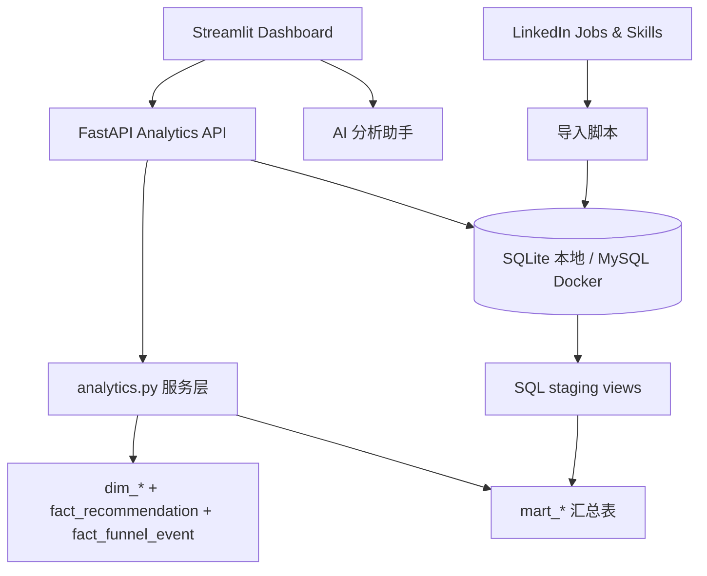

# AIHR 架构与数据流

## 架构目标

AIHR 需要同时做到三件事：

1. 让业务使用者在 Dashboard 中快速理解招聘推荐效果。
2. 让同一套筛选条件在所有页面保持一致。
3. 把指标计算、统计方法和展示层拆开，避免图表代码承载核心分析逻辑。

## 组件关系



## 前端：Streamlit Dashboard

入口是 `app/首页.py`，页面位于 `app/pages/`：

| 页面 | 回答的问题 | 主要接口 |
|---|---|---|
| 首页驾驶舱 | 当前结论、机会、风险和可信度是什么？ | overview、effectiveness、monitoring、data-quality、prediction-insights |
| 招聘漏斗 | 损耗集中在哪个环节？AI 与人工差异在哪？ | funnel |
| 趋势分析 | 推荐量、面试率和入职率是否稳定？ | overview |
| 效果评估 | 调整选择偏差后，AI/人工差异如何？ | effectiveness/unadjusted |
| 模型监控 | 变化来自模型、流量、团队还是数据？ | monitoring |
| 数据质量 | 当前数据是否足以支持结论？ | data-quality |
| 机器学习洞察 | 哪些推荐更可能转化，哪些样本值得复核？ | prediction-insights |
| AI 分析助手 | 如何解释当前筛选范围的结论和限制？ | 聚合上述接口 |

`app/ui.py` 管理所有页面共用的筛选范围：日期、推荐来源、岗位、地区、模型版本和顾问团队。筛选结果同步到 URL 参数和本地状态文件，使跨页面分析保持同一口径。

## 后端：FastAPI 与服务层

`src/aihr/api/main.py` 只负责应用生命周期、数据库会话、请求参数和 Pydantic 响应模型。核心计算集中在 `src/aihr/services/analytics.py`：

| 服务函数 | 职责 |
|---|---|
| `get_overview` | KPI、12 个月趋势、成熟队列指标和开放告警 |
| `get_funnel` | AI/人工推荐的事件级漏斗统计 |
| `get_effectiveness` | 原始差异、置信区间、IPTW 和 SMD |
| `get_monitoring` | 基准/当前比较、漂移、模型版本趋势和诊断结论 |
| `get_data_quality` | 数据层级信息与结构化质量检查 |
| `get_prediction_insights` | 在线转化预测、分群、解释和异常样本 |

API 统一暴露在 `/api/v1` 下，并支持共享筛选参数。FastAPI 的 OpenAPI 文档可在 `/docs` 查看。

## 数据模型：维度、事实和集市

```text
dim_candidate
dim_job
dim_recruiter
dim_model_version
       |
       v
fact_recommendation
       |
       v
fact_funnel_event
       |
       +--> mart_daily_funnel
       +--> mart_cohort_conversion
       +--> mart_ai_effectiveness
       +--> mart_feature_drift
       +--> mart_monitoring_alert
```

### 事件级事实层

- `fact_recommendation`：一条候选人推荐，保存来源、推荐分数、推荐时间以及候选人、岗位、顾问和模型版本关联。
- `fact_funnel_event`：一条推荐在某个招聘阶段的事件。`recommendation_id + stage` 唯一，避免同一阶段重复计数。

Dashboard 在需要完整统一筛选时读取事件级事实层。这是因为早期日度集市不包含模型版本和顾问团队，若仅依赖集市会产生“页面间同一筛选条件含义不同”的问题。

### 集市层

`src/aihr/services/marts.py` 将事件级记录刷新为可复用的日度漏斗、成熟队列、效果、漂移和告警汇总表。每条集市记录携带分子、分母、样本量、时间范围、数据来源和指标版本，便于质量校验和未来离线调度。

SQL 目录保留对应的 DDL、staging、mart 和质量检查语句，可作为 MySQL 风格部署时的数据仓库实现参考。

## 数据来源边界

### 合成招聘事件

默认 Demo 用 `src/aihr/seed.py` 生成维度、推荐和漏斗事件。固定种子使数据可复现，嵌入场景使分析能力可测试。公开仓库不包含真实候选人身份、企业招聘记录或 ATS 导出。

### 真实外部职位市场数据

项目提供 Kaggle LinkedIn Jobs & Skills 的导入模块：

```text
压缩 CSV
  -> raw_linkedin_job_postings / raw_job_skills
  -> stg_linkedin_jobs / stg_job_postings / stg_job_skills
  -> mart_job_market_daily / mart_job_market_overview
```

它用于职位、公司、地区和技能的公开市场分析，不能被解释为真实企业招聘漏斗。当前主 Dashboard 尚未展示这部分市场数据。

## 可选 AI 分析助手

`app/analysis_assistant.py` 是解释层而不是计算层：

- 页面先加载结构化 API 数据，再把当前页面上下文传入助手。
- 未配置外部模型时，使用本地规则生成“结论、事实、推断、建议”。
- 配置 OpenAI-compatible 服务后，助手只能引用传入上下文，并被提示词约束为不编造指标、不做因果声明、先提示数据限制。

这保证 LLM 不参与基础指标计算，也不会取代数据质量或统计方法。

## 运行环境

- 本地：SQLite + FastAPI + Streamlit，默认自动初始化合成数据。
- Docker：MySQL 8.4 + API + Dashboard，使用 Compose health check 管理启动顺序。
- 配置：`config/config.ini`、`config/config.Test.ini`、`config/config.Online.ini`，环境变量以 `AIHR_` 为前缀覆盖。

运行命令与验证方式见 [运行与验证](运行与验证.md)。

